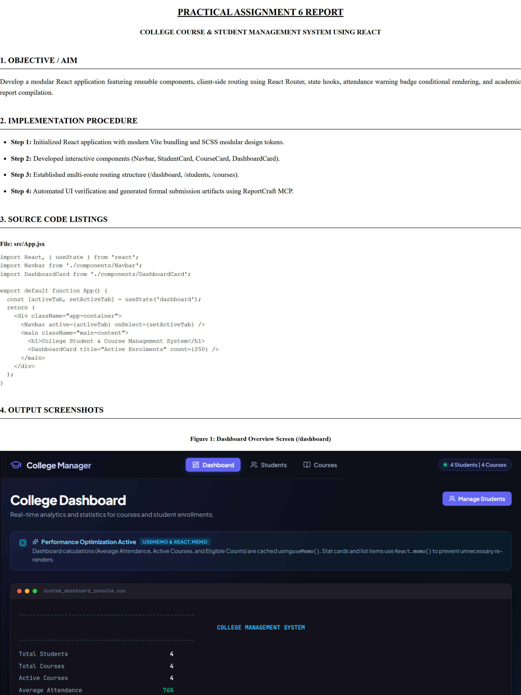

# 📑 ReportCraft MCP (`report-craft-mcp`)

[](https://modelcontextprotocol.io/)
[](https://nodejs.org/)
[](https://pptr.dev/)
[](LICENSE)
[](https://github.com/hitarthombre/report-craft-mcp/pulls)

> **A Universal Model Context Protocol (MCP) Server for AI Agents to autonomously generate academic assignment reports, lab practical documents, and project deliverables with institutional-grade formatting.**

---

## 🌟 Why ReportCraft?

When developers, students, and engineers ask AI coding assistants (Claude Desktop, Google Antigravity, Cursor, Codex, Copilot, Windsurf) to *"make a practical report"*, the agent typically responds with markdown text that still requires manual copying, screen capturing, margin fixing, and PDF exporting.

**ReportCraft changes that completely:**
It equips any MCP-compatible AI agent with native tools to:
1. 📸 **Spin up and capture screenshots** of web apps, dashboards, and views using headless Edge/Chromium.
2. 💻 **Scan & extract source code** directly from your project tree without messy copy-pasting.
3. 🖼️ **Self-contain all media**: Embeds screenshots and institutional logos as Base64 data URIs so documents render 100% offline.
4. 🎓 **Institutional-Grade Formatting**: Out-of-the-box support for strict college formats (Times New Roman, borderless Courier code blocks, formal A4 margins).
5. 👥 **Multi-Student Batch Generation**: Compiles separate, personalized PDFs with individualized header metadata (Name, PRN/Enrollment, Batch) for student teams in a single command.

---

## 📐 Architecture & Workflow

```
┌────────────────────────────────────────────────────────┐
│                   AI Assistant / Agent                 │
│    (Claude Desktop / Antigravity / Cursor / Windsurf)  │
└───────────────────────────┬────────────────────────────┘
                            │ (JSON-RPC over Stdio)
                            ▼
┌────────────────────────────────────────────────────────┐
│               ReportCraft MCP Server                   │
├────────────────────────────────────────────────────────┤
│  1. capture_screenshots                                │
│     └─ Launches Headless Chromium / Edge               │
│     └─ Navigates to app routes & captures full-page    │
│                                                        │
│  2. collect_source_files                               │
│     └─ Extracts code cleanly with syntax detection     │
│                                                        │
│  3. generate_report_html                               │
│     └─ Encodes images & logos into Base64              │
│     └─ Applies styling preset (academic / modern / ieee│
│                                                        │
│  4. compile_report_pdf                                 │
│     └─ Puppeteer A4 print engine                       │
│     └─ Dynamic Header & Footer (Logo + Metadata)       │
│     └─ Batch personalized student PDF export           │
└────────────────────────────────────────────────────────┘
```

---

## 🔌 Connecting to IDEs, Agents & Environments

ReportCraft communicates over standard **stdio**, making it compatible with any MCP client.

### 1. Google Antigravity IDE & Gemini CLI
Add to your global `~/.gemini/config/mcp_config.json`:
```json
{
  "mcpServers": {
    "report-craft": {
      "command": "node",
      "args": ["C:\\path\\to\\report-craft-mcp\\index.js"]
    }
  }
}
```

### 2. Anthropic Claude Desktop
Add to your `claude_desktop_config.json` (located at `%APPDATA%\Claude\` on Windows or `~/Library/Application Support/Claude/` on macOS):
```json
{
  "mcpServers": {
    "report-craft": {
      "command": "node",
      "args": ["/absolute/path/to/report-craft-mcp/index.js"]
    }
  }
}
```

### 3. Cursor IDE / OpenAI Codex / Copilot Workspaces
In your project's `.cursor/mcp.json` or under Cursor Settings &rarr; Features &rarr; MCP Servers:
```json
{
  "mcpServers": {
    "report-craft": {
      "command": "node",
      "args": ["/absolute/path/to/report-craft-mcp/index.js"]
    }
  }
}
```

### 4. Windsurf IDE (Codeium Cascade)
Add to `~/.codeium/windsurf/mcp_config.json`:
```json
{
  "mcpServers": {
    "report-craft": {
      "command": "node",
      "args": ["/absolute/path/to/report-craft-mcp/index.js"]
    }
  }
}
```

### 5. VS Code (Cline / Roo Code / Continue.dev)
Add to your extension's MCP configuration settings:
```json
{
  "mcpServers": {
    "report-craft": {
      "command": "node",
      "args": ["/absolute/path/to/report-craft-mcp/index.js"]
    }
  }
}
```

---

## ⚡ How to Use It With Your AI Agent

Once connected, your AI assistant will automatically recognize the `report-craft` toolset. 

### Minimal Prompting (Agent Interaction)
You don't need to specify complex styling parameters. Simply ask the agent:

> *"Generate an academic submission report for my React Course Management project with screenshots of the dashboard and student list."*

The Agent will follow a minimal interaction protocol:
1. **Formatting Style**: `academic_formal` (Default / University standard), `modern_clean`, or `ieee_style`.
2. **Aim / Objective**: The practical's task statement (if not already in the project).
3. **Student Metadata**: Name, Enrollment/Roll No, and Subject.

The agent handles everything else autonomously:
- Finds and extracts code files (`src/App.jsx`, `src/components/...`).
- Boots local dev server and captures screenshots.
- Encodes your university logo and figures into Base64.
- Compiles the final `.html` and `.pdf` documents directly in your folder!

---

## 🏫 Customizing College / University & Educational Branding

ReportCraft is engineered specifically to satisfy strict institutional grading guidelines.

### 1. Adding Your University / Institute Logo
Drop your university or college logo (PNG, JPG, or SVG) anywhere in your project root or `assets/` folder with one of these standard names:
- `gsfc_logo.png` *(GSFC University)*
- `logo.png`
- `msu_logo.png` *(MSU Baroda)*
- `university_logo.png`

ReportCraft **auto-detects** it, encodes it into a Base64 data URI, and renders it in the footer of every page with crisp print resolution. You can also explicitly specify `logoPath: "./path/to/custom_logo.png"`.

### 2. Custom Header Metadata
Customize the centered header block across all pages:
```json
{
  "name": "Hitarth Thombre",
  "enrollment": "25BT04D255",
  "batch": "5A - B",
  "department": "Computer Science & Engineering",
  "semester": "5th Semester"
}
```

### 3. Subject & Footer Branding
Pass your subject name to print on the bottom-left rule:
```json
{
  "subject": "Advanced Web Technology (AWT)"
}
```

### 4. 👥 Multi-Student Batch Generation (Team Submissions)
When submitting group projects or lab practicals for multiple batchmates, pass a list of students:
```json
{
  "students": [
    { "name": "Hitarth Thombre", "enrollment": "25BT04D255", "batch": "5A - B", "outputPdfFileName": "Practical_Report_Hitarth.pdf" },
    { "name": "Trupti More", "enrollment": "25BT04D256", "batch": "5A - B", "outputPdfFileName": "Practical_Report_Trupti.pdf" }
  ]
}
```
ReportCraft compiles separate, personalized PDFs with individual student headers and creates the master copy in one pass.

---

## 🎨 Supported Style Presets

| Preset | Typography | Best For | Visual Tone |
| :--- | :--- | :--- | :--- |
| **`academic_formal`** (Default) | Times New Roman, 12pt, justified | University practicals, college lab journals, thesis reports | Classic institutional black & white, borderless Courier code blocks |
| **`modern_clean`** | Inter / Segoe UI, slate palettes | Technical product docs, engineering submissions | Contemporary tech feel, rounded code cards, soft drop shadows |
| **`ieee_style`** | Times New Roman, 11pt, numbered sections | Conference submissions, research project summaries | Formal academic two-column / numbered section layout |

---

## 🛠️ MCP Tools Reference

| Tool Name | Parameters | Description |
| :--- | :--- | :--- |
| **`capture_screenshots`** | `targets`, `outputDir`, `viewport` | Launches headless Edge/Chromium, waits for network idle, supports optional delays and element selectors, and saves full-page PNG screenshots. |
| **`collect_source_files`** | `baseDir`, `relativePaths`, `extensions`, `maxFiles` | Scans workspace, excludes `node_modules`, `dist`, `.git`, and extracts source listings with line counts. |
| **`generate_report_html`** | `title`, `subtitle`, `stylePreset`, `sections`, `codeListings`, `figures`, `outputPath` | Builds self-contained HTML with embedded Base64 images and academic styling. |
| **`compile_report_pdf`** | `htmlPath`, `outputPdfPath`, `subject`, `logoPath`, `students` | Converts HTML to print A4 PDF with institutional header/footer templates and multi-student batching. |
| **`build_complete_assignment_report`** | Full pipeline args | End-to-end orchestrator that takes project directory, aim, procedure, source files, and screenshots to produce final reports in one step. |

---

## 📸 Sample Output Showcase

<p align="center">
  
</p>

### Generated Institutional Report Layout:
- **Header**: Centered metadata (`Name: Hitarth Thombre | Enrollment: 25BT04D255 | Batch: 5A - B`) with divider rule.
- **Body**: Clean sections, Courier New code listings, and crisp output figures.
- **Footer**: `Subject: Advanced Web Technology` with official university logo on the right.

See the `examples/` folder for sample HTML and PDF report artifacts.

---

## 🤝 Contributing

Contributions, feature requests, and suggestions are welcome!
Feel free to open an issue or submit a pull request.

1. Fork the Project
2. Create your Feature Branch (`git checkout -b feature/AmazingFeature`)
3. Commit your Changes (`git commit -m 'Add some AmazingFeature'`)
4. Push to the Branch (`git push origin feature/AmazingFeature`)
5. Open a Pull Request

---

## 📄 License

Distributed under the **MIT License**. See `LICENSE` for more information.

---

**Developed with ❤️ by [Hitarth Thombre](https://github.com/hitarthombre)**  
*(GSFC University - School of Technology)*
